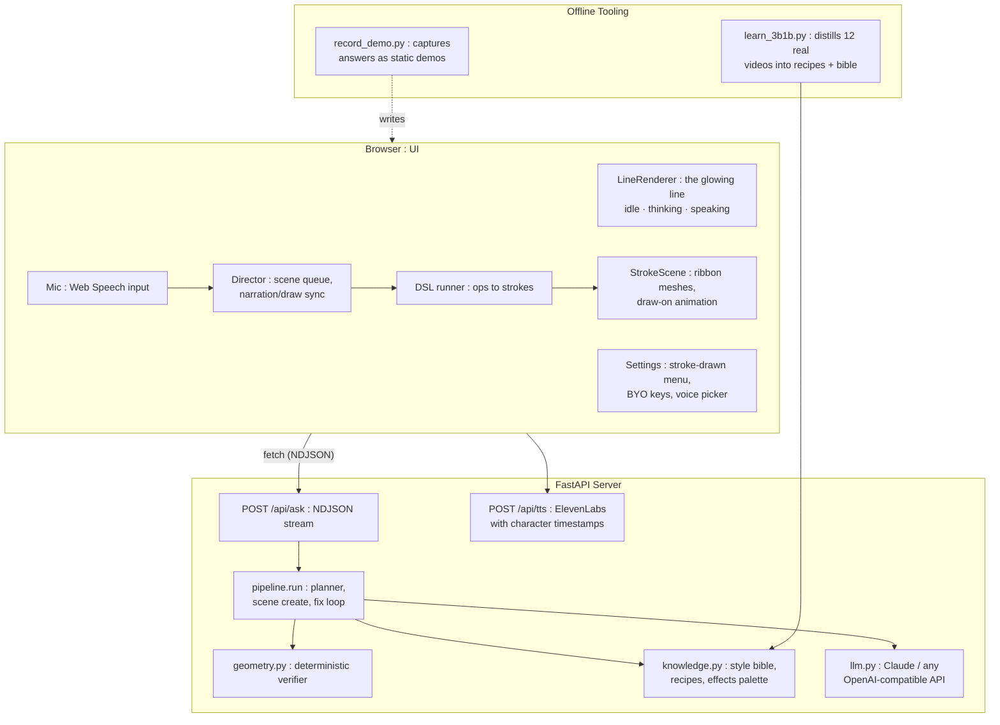
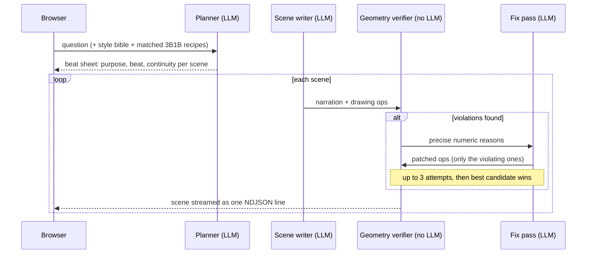

# The Line : Full Technical Write-Up
## An AI Whose Entire Interface Is One Glowing Line

**Version:** 1.0
**Author:** Ahmed Nassem
**Date:** September 2026

---

## Table of Contents

1. [Overview](#1-overview)
2. [System Architecture](#2-system-architecture)
3. [The Pipeline : Plan First, Draw Scene by Scene](#3-the-pipeline--plan-first-draw-scene-by-scene)
4. [The Drawing DSL](#4-the-drawing-dsl)
5. [The Geometry Verifier](#5-the-geometry-verifier)
6. [Learning from 3Blue1Brown's Source Code](#6-learning-from-3blue1browns-source-code)
7. [The Frontend : Rendering a Personality](#7-the-frontend--rendering-a-personality)
8. [Narration–Drawing Synchronization](#8-narrationdrawing-synchronization)
9. [Keys, Privacy, and Recorded Demos](#9-keys-privacy-and-recorded-demos)
10. [Design Decisions](#10-design-decisions)
11. [Honest Limits](#11-honest-limits)
12. [Future Work](#12-future-work)

---

## 1. Overview

The Line is an experiment in minimal interfaces: the whole product is a single glowing line on a black screen. Ask a question, typed or spoken, and it answers like a teacher at a blackboard: a synthesized voice narrates while the line redraws itself into diagrams, formulas, and animated explanations in the style of 3Blue1Brown.

Every answer is generated live by an LLM. The engineering problem is not asking a model for a drawing; it is getting drawings that are **correct, legible, and staged like a real educational video**, streamed fast enough that the line starts talking within seconds. That takes three systems working together: a plan-first pipeline, a deterministic geometry verifier, and a knowledge base distilled from 3Blue1Brown's actual published videos.

The stack: FastAPI + NDJSON streaming on the server (no WebSockets; plain HTTP is enough), Three.js WebGL in the browser, ElevenLabs (or the browser's own voice) for narration.

The line at rest, in its idle state on the hosted demo:

---

## 2. System Architecture

There is no database, no message queue, no WebSocket: one process, static files, and a streaming HTTP response. Scenes stream to the browser as they pass verification, so the `Director` plays scene *N* while the server is still generating scene *N+1*.

The settings menu is drawn in strokes just like everything else — voice picker, depth/mode controls, BYO API keys:

---

## 3. The Pipeline : Plan First, Draw Scene by Scene

An answer is produced like a small film production, one LLM call per role:

**The planner** decides how many scenes the question deserves (quick mode 1–3, video mode 4–10, auto up to 8) and writes a beat sheet: each scene gets a `purpose`, a `beat`, a `continuity` note, and the symbols it is allowed to introduce. The prompt encodes the pedagogical arc distilled from 3B1B: *hook → concrete case → manipulation → generalize → anchor*.

**The scene writer** generates one scene at a time: narration plus drawing ops in the DSL (§4). It sees the plan, the previous scene's narration, the next scene's purpose, and, critically, a live description of what is currently on screen, so scenes compose rather than collide.

**The gate** (§5) checks every candidate deterministically. Violations go back as targeted feedback and only the violating ops are regenerated, up to 3 attempts. If a scene still fails, the best candidate ships flagged rather than stalling the show. A starvation guard force-publishes early if the viewer is about to run out of content (less than ~4 seconds buffered and 14+ seconds since the last scene).

---

## 4. The Drawing DSL

The model does not output pixels or SVG; it outputs operations in a compact line-art DSL, which the browser executes as animated strokes:

| Op | Parameters | Renders as |
|---|---|---|
| `axes` | x/y ranges | Arrowed axis polylines defining the plot frame |
| `plot` | `fn`, `domain`, color | The expression sampled at 221 points (safe evaluator, no `eval`) |
| `write` | `text`, `slot` or position, size | Hershey stroke-font text, drawn letter by letter |
| `circle` | center/slot, `r` | 96-point polyline circle |
| `arrow` | `from`, `to` | Shaft plus V head |
| `line` | `from`, `to` | Single segment |
| `replace` | `old`, `with` | Fade the old element, draw the new one |
| `emphasize` | `id` | Pulse animation on the element's strokes |
| `fade` / `clear` | `id` / none | Opacity out / clear the board |
| `pause` | duration | Beat of silence |

Layout is slot-based (`title_band`, `diagram_left`, `diagram_right`, `formula_band`, `conclusion_band`), the same zones the 3B1B recipes are described in (§6), so staging knowledge transfers directly into the geometry system.

---

## 5. The Geometry Verifier

LLMs are confidently bad at spatial layout: overlapping labels, formulas off screen, arrows stabbing through diagrams. So nothing the model outputs is trusted. The verifier (`geometry.py`) is **pure Python, no LLM calls**: it maintains a registry of every element on screen (kind, bounding box, slot, which scene drew it) and measures candidate ops against reality:

| Category | Checks |
|---|---|
| Text | Real width via Hershey glyph metrics; auto-shrink to fit slots; non-ASCII stripped; over-long labels rejected |
| Placement | Off-screen text nudged back; slot occupancy (one occupant, else demand `replace`/`fade`); overlap against every element from every previous scene |
| Plots | Expression must compile and produce mostly finite values, else hard reject |
| Arrows/lines | Endpoints clamped on screen; a path crossing unrelated text or shapes is rejected with the exact obstacle named |
| Narrative | Symbol-before-its-beat: a formula planned for scene 4 may not appear in scene 2 |
| Style | Effect anti-repeat (soft, one retry) |

Feedback to the model is numeric and surgical, e.g. *"slot 'formula_band' is occupied by 'label' (scene 2); use replace"* or *"arrow 'a1' path crosses text 'title' (scene 1); reroute"*. That precision is what makes the fix loop converge in a try or two instead of thrashing.

---

## 6. Learning from 3Blue1Brown's Source Code

Correct geometry is not the same as good teaching. An offline tool (`tools/learn_3b1b.py`) reads the **actual published Manim source code and narration transcripts of twelve real 3Blue1Brown videos** (essence of calculus, Fourier series, the Basel problem, neural networks, ...) and distills three artifacts:

| Artifact | Contents | Injected into |
|---|---|---|
| Recipes (per video) | Scene-by-scene staging: beat, purpose, what's on screen in which zone, transition, narration gist | Planner prompt, the 1–2 recipes best matching the question |
| Style bible | Staging rules as principles: one idea per scene, concrete before abstract, close the loop | Every planner / scene / fix prompt |
| Effects palette | Visual effects the videos actually use | Scene-writer prompt |

Because the knowledge lives in files rather than in any one model, the backend is swappable: Claude or any OpenAI-compatible API inherits the same discipline.

---

## 7. The Frontend : Rendering a Personality

The line is not a UI element; it is the whole interface, rendered as Three.js WebGL ribbon meshes (a core stroke plus an additive glow halo). It has three states: **idle** (irregular breathing), **thinking** (a traveling sine wave), and **speaking** (an audio-reactive waveform driven by a live analyser on the narration audio).

Drawings are strokes too: every DSL op becomes polylines, extruded into ribbon meshes and animated with a draw-on progress so diagrams appear the way a hand would draw them. Text uses a Hershey stroke font: letters are paths, not glyphs, so writing draws stroke by stroke like everything else.

The recorded-demos browser lists pre-captured answers (no key required):

Even the chrome is drawn in strokes: the settings menu (voice picker, depth/mode controls, API keys), the recorded-demos list, and the mic control are all line drawings. Voice input uses the Web Speech API; the mic's audio drives the line's wave while you talk.

---

## 8. Narration–Drawing Synchronization

The narration and the drawing must land together: a label appearing three seconds after the voice mentions it reads as broken. The `Director` anchors each drawing op at a fraction of the narration, then resolves those fractions against real time:

- **With ElevenLabs:** the TTS endpoint returns character-level timestamps; ops fire when the audio playback actually reaches the anchor character.
- **With the browser voice fallback:** word-boundary events plus pacing estimates approximate the same behavior, and a pseudo-envelope drives the line's wave since there is no audio analyser on `speechSynthesis`.

A scene advances only when both the speech has finished and every op has fired and finished drawing.

---

## 9. Keys, Privacy, and Recorded Demos

**Bring-your-own-key:** on the hosted version, API keys (Anthropic, any OpenAI-compatible provider, optionally ElevenLabs) live only in the browser's `localStorage` and ride along as request headers; the server uses them transiently and never stores or logs them. The server-side config file is only writable from localhost; the hosted `/api/config` returns 403.

**Recorded demos:** an offline tool runs real questions through the full pipeline, fetches TTS with timestamps, and embeds the audio directly into static JSON files. Playback needs no key and no LLM: the browser's `Director` plays the segments exactly as it would live output. Six demos ship: pi, derivative, gravity, Fourier series, vectors, and a quick-math one-liner.

---

## 10. Design Decisions

| # | Decision | Alternative | Rationale |
|---|---|---|---|
| D1 | Plan-first, scene-at-a-time generation | One giant prompt | Quality and latency: scenes stream while later ones generate; each call has one job |
| D2 | Deterministic verifier, no LLM judge for geometry | "LLM checks LLM" | Layout is measurable; measuring is cheaper, faster, and cannot hallucinate agreement |
| D3 | Targeted fixes over full regeneration | Regenerate failed scenes wholesale | Only violating ops are re-written; converges in 1–2 tries |
| D4 | Ship the best candidate after 3 failures, flagged | Block until perfect | A live show must not stall; a flagged sketch beats dead air |
| D5 | Knowledge in files (recipes, bible, effects) | Fine-tuning a model | Swappable backends inherit the discipline; the knowledge is inspectable and editable |
| D6 | NDJSON over HTTP, no WebSockets | WS streaming | One-directional scene flow needs nothing more; less infrastructure to break |
| D7 | Slot-based layout shared by recipes and verifier | Free-form coordinates | The staging knowledge and the geometry checks speak the same language |

---

## 11. Honest Limits

- Scene generation is serial: one scene in flight at a time. The starvation guard hides this most of the time; a parallel writer would hide it always.
- The verifier measures text with the same *algorithm* as the renderer but a different Hershey font file: close enough in practice, not guaranteed pixel-identical.
- A scene that exhausts its retries ships flagged as an unverified sketch rather than being suppressed: visible honesty over silent failure.

---

## 12. Future Work

- Parallel scene generation with the existing publish-ordering logic.
- Unify verifier and renderer font metrics on one font file.
- Grow the DSL (the renderer already supports a morph the LLM contract doesn't advertise yet) and the recipe library beyond twelve videos.

---

## All captures

The images and short clips above are a curated subset. The full set of dev captures (idle, thinking, speaking, menu, list, settings, voice, plus 10 `.webm` scene clips) lives in [`data/capture/`](data/capture/).

---

*End of write-up.*
