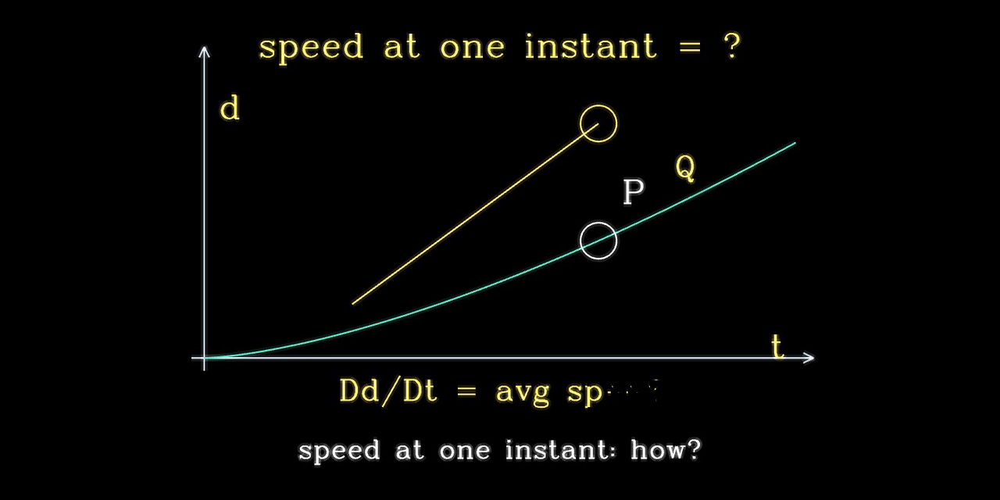

# The Line




**An AI whose entire interface is one glowing line. It speaks, and it draws its answers.**

Ask a question and a single luminous line answers: it narrates out loud while
sketching 3Blue1Brown-style visual explanations, stroke by stroke. Behind it is
a plan-first LLM pipeline with a geometry verifier that measures every label
and arrow before it is drawn, and staging knowledge distilled from
3Blue1Brown's actual published video source code.

**Live demo:** https://ahmednassem.com/projects/theline/app/

## What the live demo gives you

- **Out of the box** it plays back recorded answers that the full pipeline
  generated (open the small list icon at the bottom and pick a question).
- **Bring your own keys** (Anthropic, or any OpenAI-compatible API,
  optionally ElevenLabs for the voice): open the stroke-drawn settings, paste
  your keys, press `check keys`, and ask it anything, typed or spoken. Keys
  stay in your browser and ride along per request; the server never stores
  them.

## The pipeline: plan first, draw scene by scene

Instead of one giant prompt, an answer is produced like a small film
production. A planner decides how many scenes the question deserves (a quick
fact gets one, "explain pi" gets eight) and writes a beat sheet. Each scene is
then generated separately in a compact drawing DSL, checked, and streamed to
the browser while the next scene is still being written, so the line starts
talking within seconds:

```
planner            beat sheet (hook, build-up, payoff, anchor)
scene writer       narration + drawing ops in a line-art DSL
geometry verifier  measures every stroke before it ships
fix loop           targeted retries on exact violations
browser            line draws, voice speaks, in sync
```

### The geometry verifier

LLMs are confidently bad at spatial layout: they overlap labels, push
formulas off screen, and point arrows at nothing. So nothing the model
outputs is trusted. A verifier measures every operation with the actual
stroke font used for rendering: real text widths, bounding boxes, screen
edges for the viewer's exact aspect ratio. It checks collisions, off-screen
text, arrows that stab through diagrams, and layout slots (title band,
left/right diagram zones, formula band). Violations are sent back to the
model as precise, numeric feedback ("label 'circumference' overlaps
circle-1 by 0.21 units, move it to y > 0.74"), and only the violating
operations are regenerated. If a scene still fails after three attempts, the
best candidate wins rather than stalling the show.

### Staging learned from 3Blue1Brown's real source code

Correct geometry is not the same as good teaching. To learn staging (what to
put on screen, in what order, and why), the project reads 3Blue1Brown's actual
published material: the Manim source code of twelve real videos (essence of
calculus, Fourier series, the Basel problem, neural networks, and so on)
together with their narration transcripts. An offline tool distills each
video into a "recipe" of scenes, zones, and transitions, plus a style bible
of staging rules and a palette of visual effects the videos actually use.
That distilled knowledge is injected into every prompt, so whichever LLM is
driving inherits the discipline: open with a mystery, one idea per scene,
show the concrete case before naming it, end by closing the loop.

Because the knowledge lives in files rather than in any one model, the
backend is swappable: it runs on Claude or any OpenAI-compatible API,
configured from the line-drawn settings menu.

## Running locally

Requires Python 3.10+.

```bash
pip install -r requirements.txt
copy .env.example .env   # add API keys here, or paste them into the UI later
python main.py
```

Opens the UI. By default it serves only the recorded demos; supply keys
through the in-app settings to run the live pipeline.

## Project layout

| Path | What it is |
|---|---|
| `main.py` | FastAPI app: static UI, `/api/tts` (ElevenLabs proxy), `/api/ask` (streaming pipeline) |
| `server/` | Pipeline: planner, scene writer, geometry verifier, fix loop, config, LLM adapter |
| `knowledge/` | Distilled recipes from 3Blue1Brown's Manim sources :  staging knowledge (offline build) |
| `tools/` | Offline distillation tool (`distill.py`): Manim source + transcripts → recipes |
| `data/` | Runtime caches (e.g. shot-recorder captures used in dev) |
| `UI/` | Frontend: line-art rendering on Canvas 2D, voice in/out, settings menu |
| `UI/demos/` | Recorded answers the demo plays back |

Key design notes live in `pipeline-handoff-summary.md` and
`video-pipeline-architecture-v2.md`. The LLM prompts and the fix-loop contract
are documented in `llm-prompts-and-fix-loop.md`.

## Tech stack

- Python 3.10+, FastAPI + uvicorn, streaming responses (NDJSON)
- LLM-driven scene generation (Anthropic Claude or any OpenAI-compatible API)
- ElevenLabs for high-quality TTS with character-level timestamps (per-stroke sync)
- Web Speech API in the browser for typed-input voice synthesis / fallback
- Canvas 2D rendering; the line and its stroke font are entirely hand-drawn

## License

MIT :  see `LICENSE`.

For the full technical write-up (the plan-first pipeline, geometry verifier,
drawing DSL, and curated screenshots of the UI in action), see
[EXPLANATION.md](EXPLANATION.md).

## Acknowledgements

- Grant Sanderson (3Blue1Brown) :  for the Manim source code and the teaching
  style this project distills. The pipeline learns from the real staging
  rules used in the actual videos.
