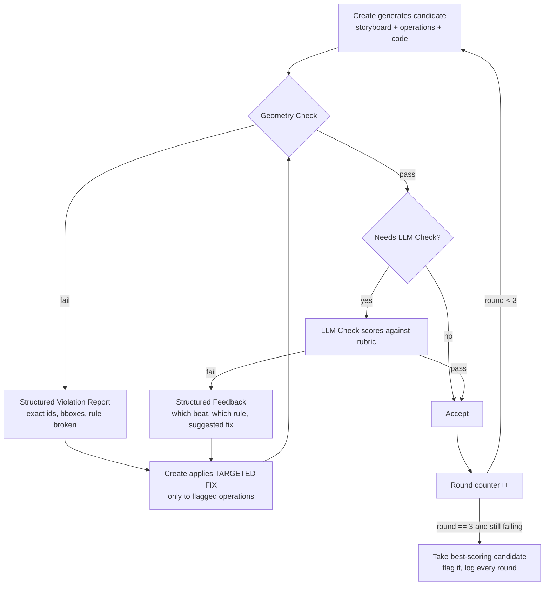

# LLM Prompts & Try-and-Fix Loop
### Companion to: Video Generation Pipeline Architecture v2

This document covers the actual prompts sent to the LLM for scene
generation and editing, and the retry loop that ties them together with
the Geometry Check and LLM Check from the main architecture doc.

---

## 1. The Try-and-Fix Loop

### 1.1 Why "regenerate the whole scene" is the wrong default

The main architecture doc caps revisions at 3 rounds. What was missing is
*what happens inside a round*. If every failed check just says "try again"
and `create` regenerates the entire beat from scratch, you're throwing away
the 90% that was already correct along with the 10% that was broken :  slow,
and it can reintroduce a bug you'd already fixed two rounds ago. The fix is
a **targeted diff loop**, not a full regenerate loop.

### 1.2 The loop, step by step



**Round counter counts full loop iterations, not individual fix attempts.**
A single round can bounce between Geometry Check and a targeted fix several
times cheaply (it's free, no API call) before it counts against the
3-round cap :  the cap exists to bound *LLM* calls, not code-level checks.

### 1.3 What makes a fix "targeted" instead of a full regenerate

The Violation Report (from Geometry Check) and the Feedback (from LLM
Check) must both be **structured and scoped to specific operations**, never
a general "this is wrong, try again":

```json
{
  "round": 2,
  "check_type": "geometry",
  "violations": [
    {
      "rule": "no_overlap",
      "mobject_ids": ["formula_ratio", "pi_value"],
      "bbox_overlap": {"x": 80, "y": 180, "w": 210, "h": 40},
      "instruction": "REPLACE formula_ratio before introducing pi_value :  formula_ratio was not cleared"
    }
  ],
  "unaffected_operations": ["diagram_circle_1", "diagram_circle_2", "label_diameter"]
}
```

`create`'s fix prompt (§2.2) only touches `mobject_ids` named in
`violations`. Everything in `unaffected_operations` is passed back
unchanged :  this is what keeps a fix round cheap and stops good work from
being discarded alongside the actual bug.

### 1.4 Logging requirement

Every round of every beat logs: round number, what failed, the exact
violation, what fix was applied, and whether it resolved on the next check.
This is the same data source as the forced-pick log in the main
architecture doc :  over time it tells you which rule types are failing
most often, which is a direct signal for where the *prompt* (§2) needs to
be tightened, rather than continuing to patch it check-by-check.

---

## 2. Full LLM Prompt Templates

These are the actual prompts to send. §2.1 is the initial generation call.
§2.2 is the targeted-fix call used inside the Try-and-Fix Loop above. Both
assume the surrounding system already injects the JSON blocks shown as
`{{...}}` :  this is prompt text, not pseudocode.

### 2.1 Initial Scene Generation Prompt

```
SYSTEM:
You are generating exactly one beat of an animated educational video
(Manim). You do not control the whole video :  only this beat. Follow every
rule below exactly. Do not skip the storyboard step.

CONTEXT
- Video depth level: {{depth_level}}              // surface | deep | detailed
- Symbols introduced so far: {{introduced_symbols}}
- This beat's purpose (from the Planner): {{beat_purpose}}
- Previous beat summary: {{previous_beat_summary}}
- Next beat's purpose (for continuity, do not resolve it here): {{next_beat_preview}}

CURRENT SCREEN STATE (you must treat this as ground truth)
{{state_registry_json}}
// active_mobjects, their bboxes, their slots, must_clear_by_beat, last_effect_used

LAYOUT SLOTS AVAILABLE
{{slot_map}}
// e.g. title_band, diagram_left, diagram_right, formula_band, conclusion_band
// A slot can hold exactly one thing. You cannot place into an occupied slot
// without an explicit REPLACE.

REQUIRED PEDAGOGICAL ARC FOR THIS DEPTH LEVEL
{{arc_beats_for_depth}}
// surface: hook, manipulation, anchor
// deep: hook, concrete_case, manipulation, generalize, anchor
// detailed: all of deep, plus formal_statement, historical_derivation, close_loop

HARD RULES :  violating any of these is an automatic reject
1. Every operation must be REPLACE(old_id, new_content), ADD(content, slot)
   into an EMPTY slot, or CLEAR(id). Free-floating "add this" with no
   operation type is invalid.
2. You may not place content into a slot listed as occupied unless the
   operation is REPLACE.
3. You may not use a symbol not present in `introduced_symbols` unless this
   beat's purpose is explicitly to introduce it.
4. You may not reuse `last_effect_used` for any comparison in this beat.
   Choose a different one from: side_by_side_highlight, color_match_tint,
   direct_morph, checkmark_fade, converging_arrows.
5. Any motion path (arrow, morph) must not cross the bbox of any
   active_mobject not part of that specific comparison.
6. No formula may appear before a preceding beat has shown the concrete or
   visual reasoning behind it (per the arc above) :  a bare formula drop is
   an automatic reject regardless of depth level.
7. If depth level is "surface," zero equations/symbols may appear on
   screen at all.

BANNED PATTERNS (never do these, at any depth level)
- A static frame with no animation.
- A formula appearing with no preceding derivation beat.
- Symbolic-only values with no concrete worked number, at deep/detailed level.
- Color used with no stated meaning tied to it.

OUTPUT FORMAT :  produce both, in this order
1. STORYBOARD (plain text, one line per arc beat used, e.g.:
   "hook: ...", "manipulation: ...", "anchor: ...")
2. OPERATIONS LIST (JSON array of REPLACE/ADD/CLEAR operations, each with
   target slot, mobject id, and a one-line description of the effect used)
3. MANIM CODE implementing exactly the operations listed in (2) :  no
   operation may appear in code that wasn't declared in the list.

SELF-CHECK (do this before finalizing your answer)
Re-read your own OPERATIONS LIST against the 7 hard rules above. If any
operation violates a rule, fix it before outputting :  do not output a
known violation and rely on the external checker to catch it.
```

### 2.2 Targeted Fix Prompt (used inside the Try-and-Fix Loop)

```
SYSTEM:
Your previous output for this beat failed one or more checks. You are not
starting over :  you are fixing only what is named below. Everything not
named must be returned unchanged.

YOUR PREVIOUS OPERATIONS LIST
{{previous_operations_json}}

VIOLATIONS TO FIX (only these :  do not touch anything else)
{{violations_json}}
// each entry: rule broken, exact mobject_ids involved, and a specific
// instruction, e.g. "REPLACE formula_ratio before introducing pi_value"

UNAFFECTED OPERATIONS (return these exactly as they were, do not regenerate)
{{unaffected_operations_json}}

TASK
Produce a corrected OPERATIONS LIST and updated MANIM CODE. The only
operations that may differ from your previous output are the ones tied to
the mobject_ids named in VIOLATIONS. If your fix requires touching an
operation not listed in VIOLATIONS, stop and explain why before proceeding
:  do not silently expand the scope of the fix.

OUTPUT FORMAT: same as the original generation prompt (storyboard update
only for the affected beat portion, corrected operations list, corrected
code).
```

### 2.3 Why the fix prompt is separate from the generation prompt

Reusing the generation prompt for fixes tends to produce a full
regeneration even when told "only fix X," because the model has no
`previous_operations` / `unaffected_operations` distinction to anchor to : 
it just writes a scene from the beat purpose again, which is how you lose
already-correct work and potentially reintroduce a fixed bug. The fix
prompt above makes "leave this alone" a structural part of the input, not
a hope embedded in an instruction.
