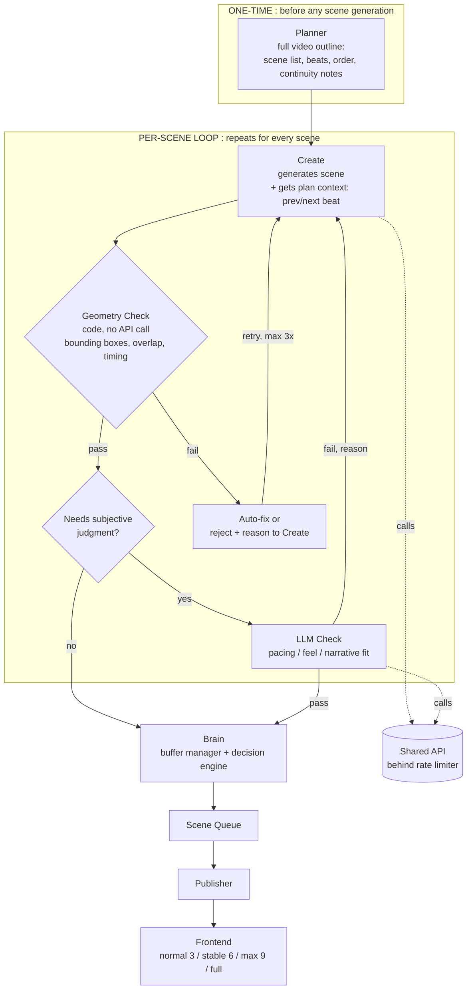
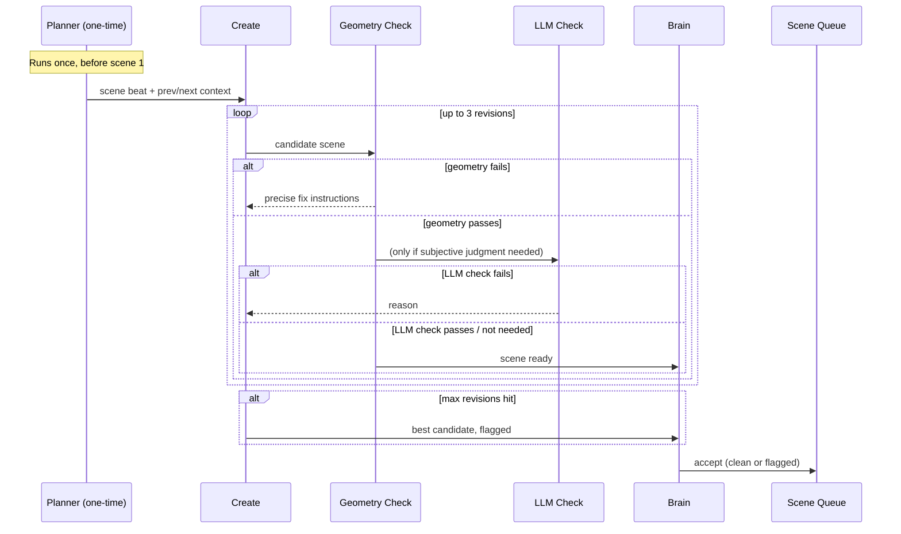
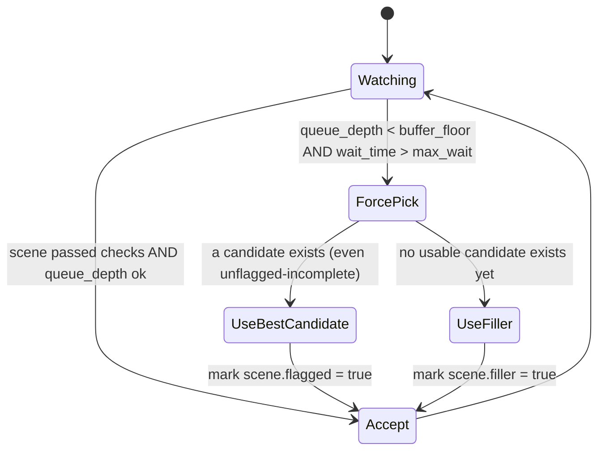

# Video Generation Pipeline :  Architecture v2
### Plan-First + Neuro-Symbolic Hybrid

---

## 1. Why v2

v1's problem: every scene went through the same `create ↔ check` loop, whether the
issue was geometric (an LLM call to catch something bounding-box math catches in
microseconds) or genuinely subjective (pacing, feel). That made the loop slower
than it needed to be, which is what forced `brain` into panic-picks in the first
place. v1 also had no memory across scenes :  scene 7 had no idea what scene 4 said.

v2 fixes both without adding steady-state latency:

- **Plan-first**: one single upfront call plans the whole video. Costs one extra
  round trip *total*, not per scene. Fixes coherence.
- **Neuro-symbolic checking**: geometric/timing correctness is verified with plain
  deterministic code, not an API call. Only genuinely subjective judgment goes to
  an LLM. Fixes speed.

---

## 2. High-Level Architecture



**Key change from v1:** `check` is no longer one box. It's split into a free
instant gate (geometry) and an expensive optional gate (LLM), and most scenes
should never reach the second one.

---

## 3. Component Descriptions

### Planner (new, one-time)
Runs once per video, before scene 1 is generated. Produces:
- ordered scene list with a one-line purpose per scene
- narration beats / timing targets
- continuity notes (what visual elements carry over, what callbacks exist)

Every `create` call for scene *N* receives: its own beat, a summary of scene
*N-1*, and a preview of scene *N+1*'s purpose. This is the only place
narrative coherence is enforced :  nothing downstream can fix a bad plan.

### Create
Generates one scene (Manim code / scene graph) from its plan context.
Unchanged responsibility from v1, but now scoped :  it doesn't need to reinvent
what the video is about each time, just execute its slice of the plan.

### Geometry Check (new :  replaces half of v1's `check`)
Deterministic, in-process, **no API call**:
- reads object bounding boxes directly from the scene definition
- checks overlap (AABB collision), off-screen elements, text clipping,
  timing collisions
- on failure: either auto-corrects (nudge/reflow) or sends a precise
  structured reason back to `create` :  not a vague "this is wrong"

This absorbs most of what v1's `check` was doing, for near-zero latency.

### LLM Check (subjective judgment only)
Only invoked when geometry passes but the scene type warrants a feel/pacing
judgment (e.g. freeform or novel scenes :  see Rule 6). Scored, not just
pass/fail where possible, so `brain` can use partial credit under pressure.

### Brain (buffer manager / decision engine)
Unchanged role, sharper logic :  see §5 for its state diagram. Decides:
accept into queue, force-pick under deadline pressure, or hold.

### Scene Queue → Publisher → Frontend
Unchanged from v1. Frontend buffer levels: **normal (3) / stable (6) / max (9)
/ full (waits for entire video)**.

### Shared API Limiter (new, explicit)
`create` and `LLM check` both hit the same underlying API. A shared
semaphore/queue sits in front of it so they can't starve each other under
load :  this was an implicit bottleneck in v1, made explicit here.

---

## 4. Per-Scene Sequence



---

## 5. Brain's Decision Logic



**Force-pick trigger (exact condition):**
```
queue_depth < buffer_floor  AND  time_since_last_publish > max_wait
```
Both conditions required :  low queue depth alone isn't urgent if you just
published; long wait alone isn't urgent if the queue is still healthy.

---

## 6. Rules

1. **Geometry checks always run first, and are free.** No scene reaches the
   LLM check without passing geometry. No API call is spent on something
   code can verify.

2. **LLM check is opt-in per scene, not default.** Only scenes flagged by
   `create` as "novel / freeform" (i.e. not built from a known-safe template
   or layout pattern) go to LLM check. Routine/templated scenes skip it
   entirely.

3. **Max 3 revision rounds per scene.** If `create`↔`check` hasn't converged
   in 3 rounds, stop looping. Take the best candidate so far and flag it : 
   do not loop indefinitely hoping for convergence.

4. **Force-pick requires both conditions**, not just one:
   `queue_depth < buffer_floor` **and** `time_since_last_publish > max_wait`.

5. **Every forced pick is logged** with: scene id, reason, queue depth at
   time of pick, and whether it was `flagged` (imperfect but real) or
   `filler` (no real candidate existed). This data tells you whether forcing
   is a rare edge case or a sign your pipeline is structurally too slow : 
   check it before tuning anything else.

6. **Filler is the fallback of last resort, not the default fallback.**
   Prefer shipping the best real candidate (flagged) over filler. Only use
   filler if no candidate has passed geometry yet at all.

7. **Shared API access is rate-limited**, not open. `create` and `LLM check`
   share one limiter so neither starves the other under load.

8. **Every `create` call receives plan context**: its own beat from the
   Planner, a one-line summary of the previous scene, and a preview of the
   next scene's purpose. No scene is generated in isolation.

9. **Frontend buffer level starts at `normal` (3)** for fast first paint, and
   only promotes to `stable`/`max` if generation has been consistently
   outpacing playback over a rolling window :  it is not a static setting
   picked upfront.

10. **If scenes are ever generated in parallel**, a sequence number is
    assigned before generation starts, and the Scene Queue enforces order : 
    scene 7 finishing before scene 5 must not let it jump ahead.

11. **Flagged and filler scenes are visually marked for the viewer** with a
    lightweight note (your "note: this is v1" idea) :  never silently shipped
    as if fully verified.

---

## 7. What Changed vs v1, at a Glance

| | v1 | v2 |
|---|---|---|
| Coherence across scenes | none :  each scene generated blind | Planner gives every scene prior/next context |
| Geometry/overlap checking | via LLM `check` (slow, API cost) | plain code, instant, free |
| Subjective checking | every scene, iterate-until-pass | only novel scenes, bounded to 3 rounds |
| Force-pick fallback | accept + disclaimer | best-candidate flagged, filler only as last resort |
| API contention | implicit, unmanaged | explicit shared limiter |
| Buffer level | fixed 4 presets, user-picked | starts low, adapts based on real throughput |
| Screen-state awareness | none :  each beat adds blind | live registry, explicit remove-then-add |
| Explanation depth | one fixed level | Planner sets surface / deep / detailed per video |

---

## 8. Scene-State Model (v2.1)

### 8.1 The problem this solves

`create` was generating each beat as "add this new thing" with no memory of
what was already occupying the frame. Symptoms observed directly in output:

- New text (`pi = 3.14159265...`) rendered **on top of** old text
  (`C / d = 3.14...`) instead of the old text being cleared first.
- Two comparison diagrams placed close enough that a connecting arrow had to
  cross straight through an unrelated label to reach them.
- The same "converging arrows" comparison effect reused every time, with no
  awareness of whether the space around it was actually clear for it.

Root cause: there is no ground truth of "what is on screen right now" that
`create` reads before generating the next beat. Fix: make that ground truth
explicit and mandatory.

### 8.2 The State Registry

A structured object, updated after every beat, passed into the next beat's
generation call. Not implicit, not inferred :  read and written on every step.

```json
{
  "beat_index": 4,
  "active_mobjects": [
    {
      "id": "formula_ratio",
      "type": "text",
      "content": "C / d = 3.14...",
      "bbox": {"x": 80, "y": 180, "w": 520, "h": 90},
      "slot": "formula_band",
      "color": "yellow",
      "introduced_at_beat": 2,
      "must_clear_by_beat": 4
    },
    {
      "id": "diagram_circle_1",
      "type": "group",
      "bbox": {"x": 300, "y": 280, "w": 380, "h": 160},
      "slot": "diagram_left",
      "introduced_at_beat": 1,
      "must_clear_by_beat": null
    }
  ],
  "last_effect_used": "converging_arrows",
  "occupied_slots": ["formula_band", "diagram_left", "diagram_right"]
}
```

Every field here answers a question `create` previously had to guess at:
what exists, where exactly it is, what slot it claims, when it's due to be
removed, and what visual effect was used last.

### 8.3 Rule: Remove-then-Add, never Add-only

Every beat instruction must resolve to one of three explicit operations : 
free-form "add this" is no longer a valid instruction shape:

| Operation | Meaning | Registry effect |
|---|---|---|
| `REPLACE(old_id, new_content)` | old_id is removed, new content takes its slot | old_id deleted, new entry added with same slot |
| `ADD(content, slot)` | slot must be currently empty | rejected if slot is occupied :  forces an explicit REPLACE or ADD_TO_EMPTY_SLOT instead |
| `CLEAR(id)` | remove with no replacement | entry deleted, slot marked free |

This is what directly fixes the pi/formula overlap: beat 4 must say
`REPLACE(formula_ratio, "pi = 3.14159265...")`, not just "show pi = ...".
The old text is guaranteed gone before the new text exists.

### 8.4 Rule: Fixed Layout Slots

Predefine named regions of the frame once, reused across the whole video:

```
┌─────────────────────────────────────┐
│              title_band              │
├───────────────┬───────────────────────┤
│  diagram_left │    diagram_right      │
├───────────────┴───────────────────────┤
│              formula_band             │
├─────────────────────────────────────┤
│             conclusion_band           │
└─────────────────────────────────────┘
```

`create` places content into a **slot**, never a raw `(x, y)` coordinate.
Two consequences:

- A slot can only hold one thing at a time :  the registry enforces this, so
  "two diagrams too close together" becomes structurally impossible; they'd
  have to occupy `diagram_left` and `diagram_right`, which are pre-spaced
  with a guaranteed gap.
- Comparison labels and connecting arrows are generated with full knowledge
  of exactly where both slots are, so an arrow can be routed around the
  `diagram_left` label's bbox instead of through it :  this is a solvable
  pathing problem once both endpoints and the obstacles are known
  quantities, not a guess.

### 8.5 Rule: Effect Palette with Anti-Repeat

`create` is given a fixed set of comparison/transition effects, not one
default it always reaches for:

- side-by-side highlight (both objects glow, no arrow needed)
- color-match tint (recolor both to the same hue to signal equivalence)
- direct morph (one object transforms into the shape/position of the other)
- checkmark-and-fade (old fades, checkmark confirms, new fades in)
- converging arrows (existing effect :  now one option among several)

**Rule:** `last_effect_used` (from the registry) cannot be reused on the
immediately following comparison. This is a one-line check against state
that already exists :  no new infrastructure needed beyond the registry.

**Rule:** any effect with a motion path (arrows, morphs) must have its path
checked against every `bbox` in `active_mobjects` before being allowed. If
the path intersects a bbox not involved in the comparison, reject and
regenerate with a different effect or a routed path.

### 8.6 Geometry Check extension

The existing Geometry Check (§3) validated only the final frame of a beat.
Extend it to validate the **whole beat**, using the registry:

1. At beat end, every mobject flagged `must_clear_by_beat <= current_beat`
   must be absent from `active_mobjects` :  if not, reject and force a
   `CLEAR` or `REPLACE` instruction back to `create`.
2. No two `active_mobjects` may have overlapping `bbox` values at any point
   during the beat's animation, not just at the final frame :  sample
   bounding boxes at several timestamps through the beat's `run_time`, not
   only t=0 and t=end.
3. No motion path may cross a `bbox` not listed as part of that motion's
   own comparison pair.

All three are pure geometry/data checks :  zero API calls, same as the
original Geometry Check design.

---

## 9. Explanation Depth Levels (v2.1)

### 9.1 Where depth is set

The **Planner** sets one depth level for the entire video, once, upfront : 
not per scene. This keeps every scene internally consistent in how much it
assumes the viewer already knows, and keeps `create` calls scoped: it
receives its depth level as fixed context, same as it receives plan context.

### 9.2 The three levels, in full

Every level uses the same five-beat pedagogical arc from §"why it's flat"
(hook → concrete case → manipulation → generalize → anchor). Depth changes
**how many beats are included and how far each one goes** :  deeper levels
add beats on top of surface, they don't replace or re-shoot it.

#### Surface :  intuition only, no symbols

**Goal:** the viewer walks away with a felt sense of the fact, nothing more.

**Beats included:** hook, manipulation, anchor. (Concrete case and
generalize are skipped entirely :  no formula appears at this level.)

**Worked example (circle/pi):**
1. *Hook:* "Every circle has a hidden rule connecting its width to the
   distance around it. Watch."
2. *Manipulation:* unroll the diameter segment along the circle's arc,
   let it lap around, land just past 3 times with a small leftover.
3. *Anchor:* repeat with a visibly bigger circle :  same "just past 3, same
   leftover" result. Text: "always the same, no matter the size."

**What's explicitly excluded:** the symbol π, the value 3.14159, the
formula C = πd, any mention of irrationality. This level should contain
zero equations.

#### Deep :  mechanism, still visual, formula introduced

**Goal:** the viewer understands *why* the ratio is constant, and meets the
formula only after having seen the reason it exists.

**Beats included:** all five, but generalize is visual before it's symbolic.

**Worked example (circle/pi):**
1. *Hook:* same as surface, or a slightly sharper version ("what if I told
   you this ratio never changes, ever?").
2. *Concrete case:* d = 10 → show the arc length coming out to ≈ 31.4,
   real numbers on screen, not just symbols.
3. *Manipulation:* the same unroll, but now explicitly measure the
   leftover sliver and label it ≈ 0.14 × d.
4. *Generalize:* do the unroll again on a circle of a different size : 
   same leftover proportion. **Now** introduce the name: "this constant
   ratio has a name :  pi." Show C/d = π forming from the two labeled
   pieces (3 whole diameters + the sliver) that are already on screen.
5. *Anchor:* connect to C = 2πr as the same fact in terms of radius
   instead of diameter :  a quick relabeling of the same diagram, not a new
   scene.

**Optional add-on at this level:** a hexagon inscribed in the circle, its
perimeter visibly less than the circle's circumference, hinting at the
polygon-approximation idea without fully deriving it :  sets up Detailed.

#### Detailed :  formal, historical, still animated

**Goal:** rigor and derivation, for a viewer who wants the actual math, not
just a wall of text :  this level must **still** be built from animated
beats, not a static bullet-point recap.

**Beats included:** all five from Deep, plus explicit formal/historical
extensions:

6. *Formal statement:* state C/d = π as a definition, note explicitly that
   π is irrational (decimal never terminates or repeats) :  show the digit
   string continuing to visually reinforce "never repeats," don't just say
   it in a caption.
7. *Historical derivation:* Archimedes' method :  inscribe a hexagon inside
   the circle and circumscribe one outside it; animate both perimeters
   converging toward the circle's circumference as the number of polygon
   sides increases (hexagon → 12-gon → 24-gon). This is the actual
   historical technique used to bound π before calculus existed, and it
   reuses the same circle asset from the earlier beats.
8. *Close the loop:* land back on C = 2πr, now with the derivation behind
   it instead of just the formula.

### 9.3 Rule: Asset reuse across levels

All three levels for a given concept reuse the **same underlying circle,
same colors, same coordinate layout** :  established once in the Surface
beats and carried forward. Deep and Detailed do not regenerate a new circle
from scratch; they add beats and relabel the existing one. This keeps
render cost proportional to the extra beats added, not to three full
independent videos.

### 9.4 Rule: No symbol before its beat

A symbol (π, C, d, an equation) may not appear on screen before the beat
that's explicitly responsible for introducing it, per the tables above.
This is enforceable by the Geometry/Content check: scan the beat's on-screen
text against a per-video "introduced symbols" list carried in the Planner's
output, reject if a beat uses a symbol not yet marked introduced.

### 9.5 How this interacts with the Scene-State Model (§8)

Depth level and scene-state are independent axes, but they compose: a
Detailed-level video has more beats per concept, which means more
`REPLACE`/`CLEAR` operations happen per concept than at Surface level. The
State Registry (§8.2) is what makes this safe :  more beats means more
opportunities for stale content to linger, which is exactly the failure
mode §8 was built to prevent. Detailed-level scenes should be expected to
exercise the Registry the hardest, and are the best scenes to spot-check
first when validating the fix.
