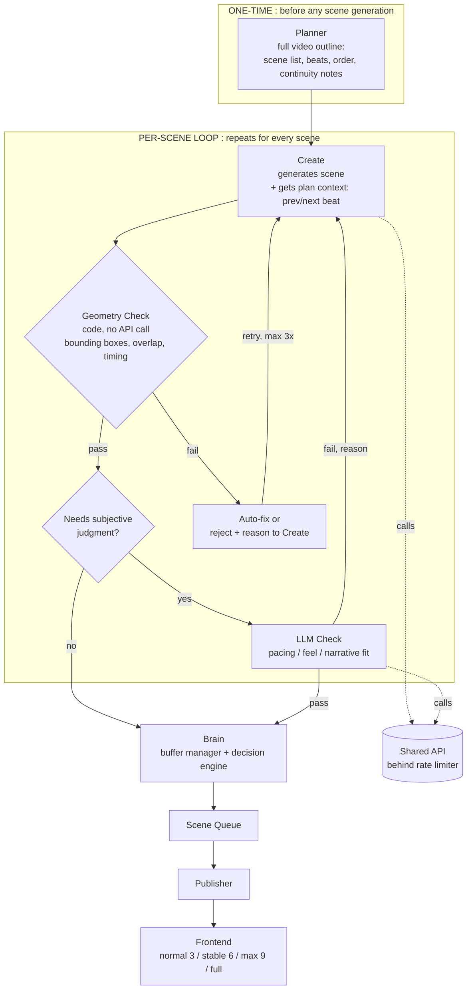
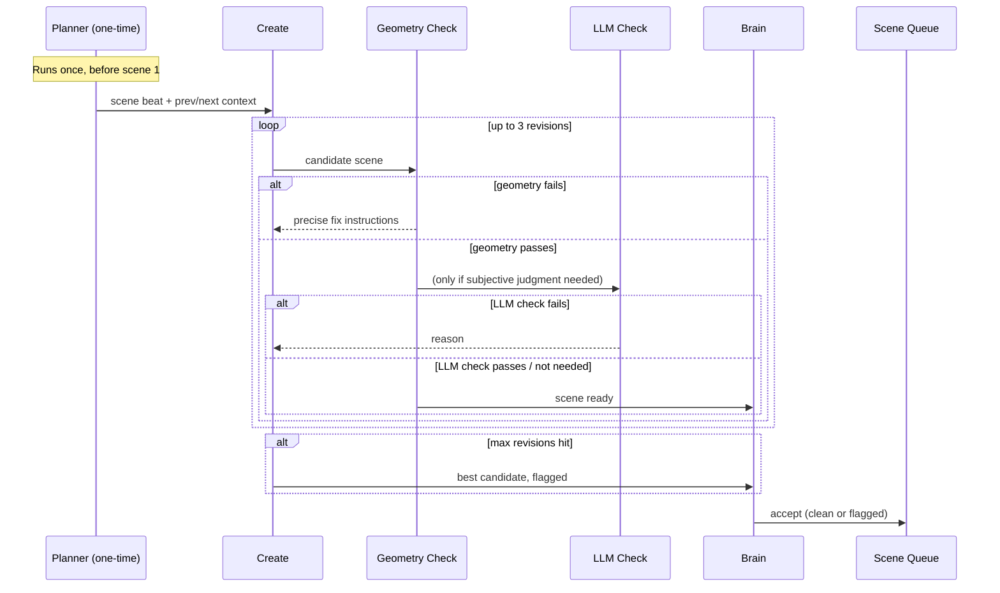
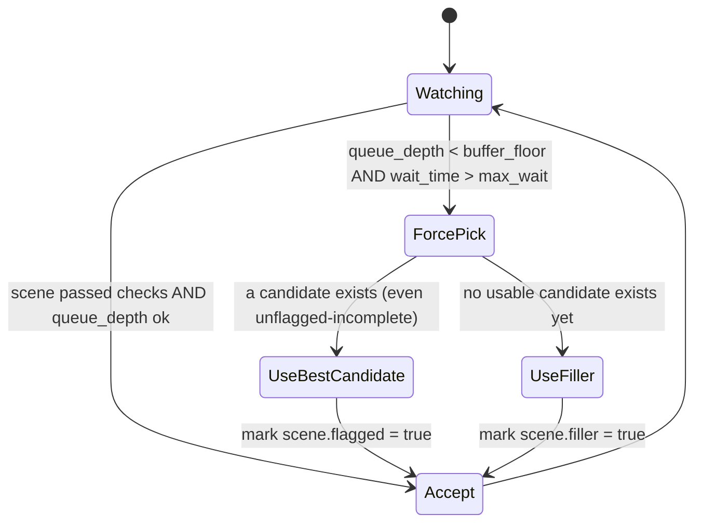

# Video Generation Pipeline :  Architecture v2
### Plan-First + Neuro-Symbolic Hybrid

---

## 1. Why v2

v1's problem: every scene went through the same `create ↔ check` loop, whether the
issue was geometric (an LLM call to catch something bounding-box math catches in
microseconds) or genuinely subjective (pacing, feel). That made the loop slower
than it needed to be, which is what forced `brain` into panic-picks in the first
place. v1 also had no memory across scenes :  scene 7 had no idea what scene 4 said.

v2 fixes both without adding steady-state latency:

- **Plan-first**: one single upfront call plans the whole video. Costs one extra
  round trip *total*, not per scene. Fixes coherence.
- **Neuro-symbolic checking**: geometric/timing correctness is verified with plain
  deterministic code, not an API call. Only genuinely subjective judgment goes to
  an LLM. Fixes speed.

---

## 2. High-Level Architecture



**Key change from v1:** `check` is no longer one box. It's split into a free
instant gate (geometry) and an expensive optional gate (LLM), and most scenes
should never reach the second one.

---

## 3. Component Descriptions

### Planner (new, one-time)
Runs once per video, before scene 1 is generated. Produces:
- ordered scene list with a one-line purpose per scene
- narration beats / timing targets
- continuity notes (what visual elements carry over, what callbacks exist)

Every `create` call for scene *N* receives: its own beat, a summary of scene
*N-1*, and a preview of scene *N+1*'s purpose. This is the only place
narrative coherence is enforced :  nothing downstream can fix a bad plan.

### Create
Generates one scene (Manim code / scene graph) from its plan context.
Unchanged responsibility from v1, but now scoped :  it doesn't need to reinvent
what the video is about each time, just execute its slice of the plan.

### Geometry Check (new :  replaces half of v1's `check`)
Deterministic, in-process, **no API call**:
- reads object bounding boxes directly from the scene definition
- checks overlap (AABB collision), off-screen elements, text clipping,
  timing collisions
- on failure: either auto-corrects (nudge/reflow) or sends a precise
  structured reason back to `create` :  not a vague "this is wrong"

This absorbs most of what v1's `check` was doing, for near-zero latency.

### LLM Check (subjective judgment only)
Only invoked when geometry passes but the scene type warrants a feel/pacing
judgment (e.g. freeform or novel scenes :  see Rule 6). Scored, not just
pass/fail where possible, so `brain` can use partial credit under pressure.

### Brain (buffer manager / decision engine)
Unchanged role, sharper logic :  see §5 for its state diagram. Decides:
accept into queue, force-pick under deadline pressure, or hold.

### Scene Queue → Publisher → Frontend
Unchanged from v1. Frontend buffer levels: **normal (3) / stable (6) / max (9)
/ full (waits for entire video)**.

### Shared API Limiter (new, explicit)
`create` and `LLM check` both hit the same underlying API. A shared
semaphore/queue sits in front of it so they can't starve each other under
load :  this was an implicit bottleneck in v1, made explicit here.

---

## 4. Per-Scene Sequence



---

## 5. Brain's Decision Logic



**Force-pick trigger (exact condition):**
```
queue_depth < buffer_floor  AND  time_since_last_publish > max_wait
```
Both conditions required :  low queue depth alone isn't urgent if you just
published; long wait alone isn't urgent if the queue is still healthy.

---

## 6. Rules

1. **Geometry checks always run first, and are free.** No scene reaches the
   LLM check without passing geometry. No API call is spent on something
   code can verify.

2. **LLM check is opt-in per scene, not default.** Only scenes flagged by
   `create` as "novel / freeform" (i.e. not built from a known-safe template
   or layout pattern) go to LLM check. Routine/templated scenes skip it
   entirely.

3. **Max 3 revision rounds per scene.** If `create`↔`check` hasn't converged
   in 3 rounds, stop looping. Take the best candidate so far and flag it : 
   do not loop indefinitely hoping for convergence.

4. **Force-pick requires both conditions**, not just one:
   `queue_depth < buffer_floor` **and** `time_since_last_publish > max_wait`.

5. **Every forced pick is logged** with: scene id, reason, queue depth at
   time of pick, and whether it was `flagged` (imperfect but real) or
   `filler` (no real candidate existed). This data tells you whether forcing
   is a rare edge case or a sign your pipeline is structurally too slow : 
   check it before tuning anything else.

6. **Filler is the fallback of last resort, not the default fallback.**
   Prefer shipping the best real candidate (flagged) over filler. Only use
   filler if no candidate has passed geometry yet at all.

7. **Shared API access is rate-limited**, not open. `create` and `LLM check`
   share one limiter so neither starves the other under load.

8. **Every `create` call receives plan context**: its own beat from the
   Planner, a one-line summary of the previous scene, and a preview of the
   next scene's purpose. No scene is generated in isolation.

9. **Frontend buffer level starts at `normal` (3)** for fast first paint, and
   only promotes to `stable`/`max` if generation has been consistently
   outpacing playback over a rolling window :  it is not a static setting
   picked upfront.

10. **If scenes are ever generated in parallel**, a sequence number is
    assigned before generation starts, and the Scene Queue enforces order : 
    scene 7 finishing before scene 5 must not let it jump ahead.

11. **Flagged and filler scenes are visually marked for the viewer** with a
    lightweight note (your "note: this is v1" idea) :  never silently shipped
    as if fully verified.

---

## 7. What Changed vs v1, at a Glance

| | v1 | v2 |
|---|---|---|
| Coherence across scenes | none :  each scene generated blind | Planner gives every scene prior/next context |
| Geometry/overlap checking | via LLM `check` (slow, API cost) | plain code, instant, free |
| Subjective checking | every scene, iterate-until-pass | only novel scenes, bounded to 3 rounds |
| Force-pick fallback | accept + disclaimer | best-candidate flagged, filler only as last resort |
| API contention | implicit, unmanaged | explicit shared limiter |
| Buffer level | fixed 4 presets, user-picked | starts low, adapts based on real throughput |
